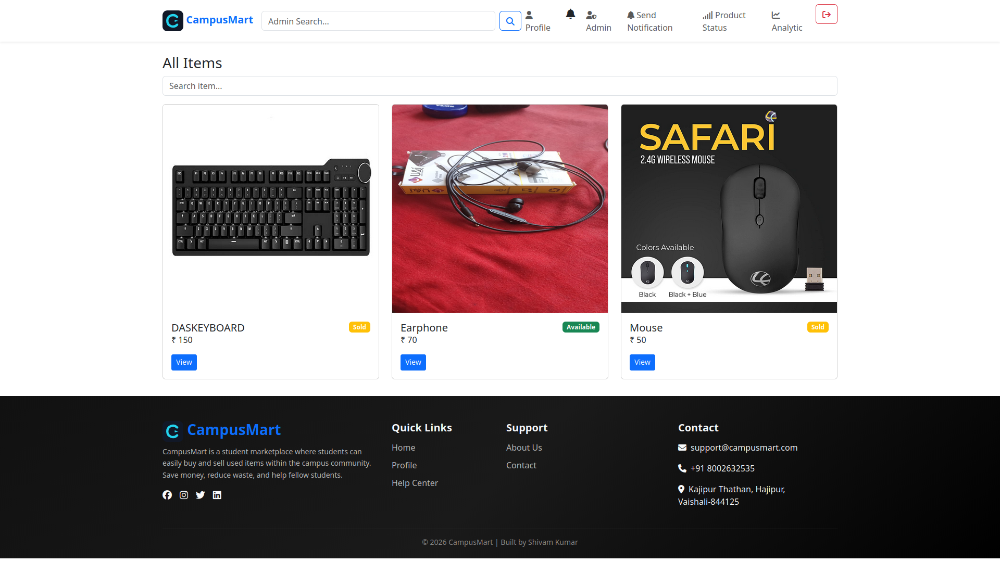
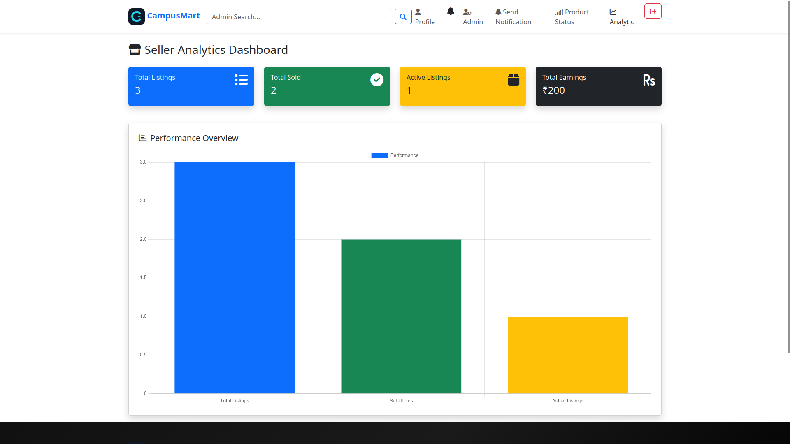
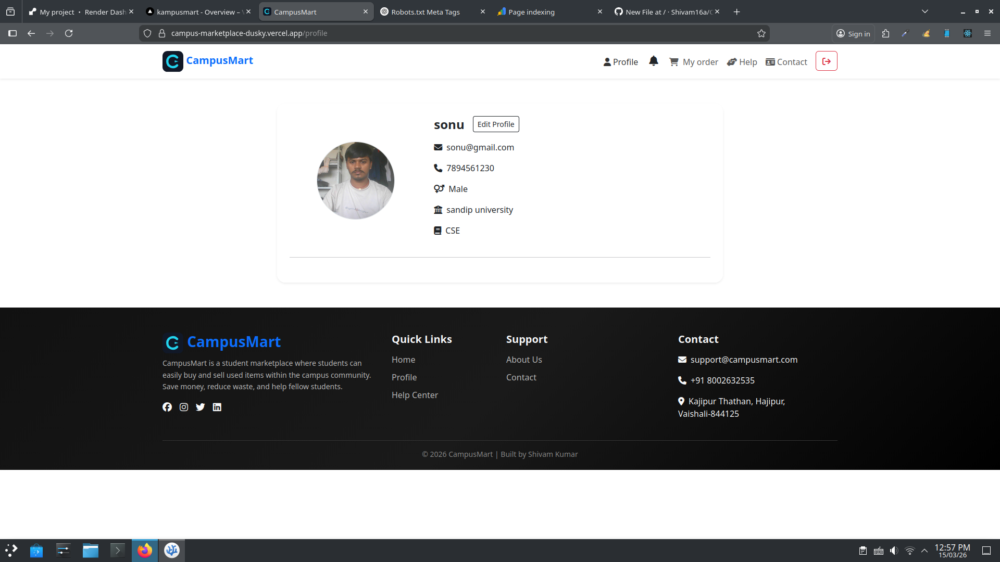
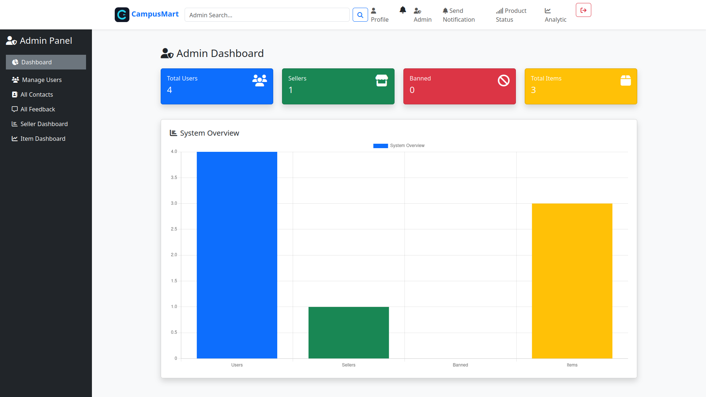

# Hi 👋, I'm Shivam Kumar

💻 MERN Stack Developer  
🚀 Passionate about building scalable web applications  
📍 India  

# 🛒 CampusMart

<p align="center">

</p>

<p align="center">

</p>

---

## 🌐 Live Website

https://campus-marketplace-dusky.vercel.app

---

## 🚀 About Project

**CampusMart** is a MERN Stack based student marketplace where students can **buy and sell items inside their campus easily and securely.**

This platform helps students:

- Buy second-hand items
- Sell unused products
- Connect with campus buyers & sellers

---

## ✨ Features

- 🔐 User Authentication (Register / Login)
- 🛍 Buy & Sell Products
- ❤️ Wishlist System
- 🔔 Notifications
- 💬 Contact Seller via WhatsApp
- 👤 User Profile
- 🧑‍💼 Admin Dashboard
- 📦 Product Management

---

## 🛠 Tech Stack

**Frontend**

- React.js
- Bootstrap
- Axios
- React Router

**Backend**

- Node.js
- Express.js

**Database**

- MongoDB

**Other**

- JWT Authentication
- Vercel Deployment
- GitHub

---

## 📊 GitHub Stats


---

## 📈 Contribution Graph


---

## 📂 Project Structure

```
CampusMarketplace
│
├── frontend
│   ├── public
│   ├── src
│   │   ├── components
│   │   ├── pages
│   │   ├── utils
│   │   └── App.jsx
│
├── backend
│   ├── controllers
│   ├── models
│   ├── routes
│   ├── middleware
│   └── server.js
│
└── README.md
```

---

## 📸 Screenshots

### Home Page


### Products Page


### User Profile


### Admin Dashboard


---

## ⚙️ Installation

Clone repository
git clone https://github.com/Shivam16a/CampusMarketplace.git

Go to project folder
cd CampusMarketplace

Install dependencies
npm install

Run backend
cd backend
npm run dev

Run frontend
cd frontend
npm run dev

---

## 🔑 Environment Variables

Create `.env` file inside backend folder
PORT=5000
MONGO_URI=your_mongodb_connection
JWT_SECRET=your_secret_key


---

## 🌍 Deployment

Frontend deployed on **Vercel**

Backend deployed on **Render**

---

## 🤝 Contributing

Pull requests are welcome.

---

## 👨‍💻 Author

**Shivam Kumar**

GitHub  
https://github.com/Shivam16a

Live Project  
https://campus-marketplace-dusky.vercel.app


